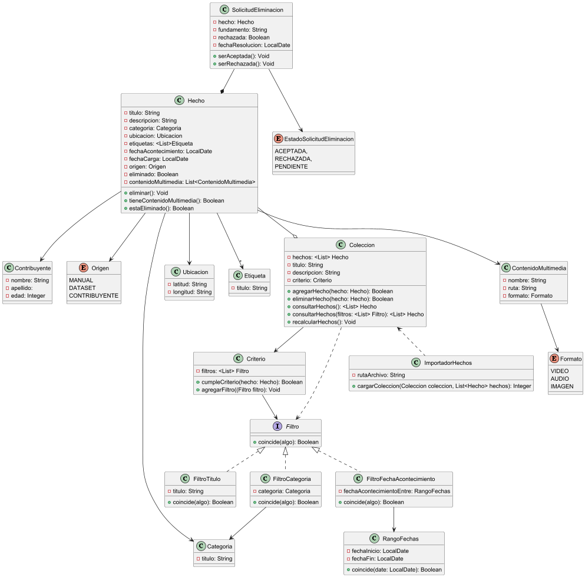

# Entrega 1

## Justificaciones Diagrama de Clases y Diseño Inicial

### Fuentes de Datos

Las fuentes de datos no son una clase a modelar en nuestra capa de dominio. Esto se debe a que consideramos que estas clases estarán contenidas en la capa de servicios, ya que su funcionalidad será principalmente la consulta a datasets y bases de datos.

### Importar archivos CSV

La importación de archivos y su respectiva asociación a una colección es abstraída en una clase `ImportadorHechos`.

Esta clase será llamada por la respectiva clase de la fuente que se encuentre en otra capa y se encargará de "llenar" la Colección ya inicializada con nombre, descripción, etc. con una lista de hechos recibida de una capa superior.

### Colecciones

En el caso de las Colecciones, se las diseñó con sus respectivos atributos identificatorios y también con una lista de Hechos. Las Colecciones poseen un Criterio, que será quien tendrá la responsabilidad de determinar si un Hecho cumple con los requisitos para pertenecer a la Colección.

Las Colecciones, al ser consultadas, devuelven los Hechos que pertenecen a ellas; contemplando que se podrían consultar utilizando filtros. Cada vez que se consultan los hechos de la colección es necesario recalcular en caso de que se hayan eliminado del sistema.

### Criterios de pertenencia

Los Criterios de pertenencia fueron representados como una clase. Para el Criterio, se decidió utilizar el Patrón Strategy. Cada Criterio tiene una lista de `ElementoCriterio`, encargados de que para un Hecho se cumpla una característica en particular, en esta primera iteración: que el hecho tenga un cierto título, una cierta categoría o que su fecha de acontecimiento esté contenida dentro de un rango.

Cada elemento criterio implementa una interfaz criterio, la cual define un método `coincide`; cada elemento se encarga de definir este método a su conveniencia.

### Filtros vs Criterios

Para los filtros y los criterios, encontramos una similitud entre los mismos: ambos definen si un Hecho cumple o no con los mismos, utilizando los mismos atributos y las mismas comparaciones. Por lo mismo se decidió que al consultar a una Colección utilizando un filtro se esté consultando a la Colección utilizando un Criterio.

### Contribuyentes y visualizadores

Para la solución implementada, no se modelaron los visualizadores ni los administradores. Se entiende que un visualizador es una persona que ingresa al sistema como Guest. Como no se guarda información del mismo y no tiene ningún tipo de relación con nuestro dominio, no se vio necesario su diagramado.

El visualizador será un usuario más que interactuará con el sistema, pero que esté presente en los casos de uso no significa que sea una clase en el mismo.

Los visualizadores como los contribuyentes podrán subir hechos utilizando la interfaz del sistema pero sin relacionarse con los mismos.

En caso de que un Contribuyente quiera "dejar su firma" (darse a conocer) en un Hecho, el mismo tendrá un atributo Contribuyente en el que se guardará quién realizó esa contribución, utilizando al contribuyente como un Value Object.

### Administradores

Los Administradores no fueron incluidos en el diagrama como una clase. Esto se debe a que las acciones que realizan: crear colecciones, aceptar o rechazar solicitudes o importar hechos desde un archivo CSV son casos de uso.

Los Administradores podrán cumplir con estas funcionalidades utilizando la interfaz del sistema. Todas estas funcionalidades y responsabilidades fueron delegadas a las clases correspondientes:

#### Caso crear colección

La creación de una colección quedó delegada a la instanciación de la misma. Cuando un administrador decida crear una colección podrá completar los datos de la misma y será la capa de controllers quien enviará esta petición a la capa de servicios y esta creará la Colección instanciándola en el sistema.

#### Aceptar o Rechazar solicitud de eliminación

La `SolicitudEliminación` cuenta con los métodos respectivos para ser aceptada o rechazada. Por lo que al aceptar la misma o rechazarla esta marcará al Hecho como eliminado o no.

#### Importar hechos desde un archivo CSV

La importación de hechos quedó delegada a la capa de servicios. Es la fuente estática quien se encarga de importar los hechos desde un archivo CSV y llamar al `ImportadorHechos` para que cargue una colección.

### Etiquetas

Las etiquetas poseen un atributo de tipo String. Un Hecho puede tener muchas etiquetas. Las cuales conserva en una lista.
