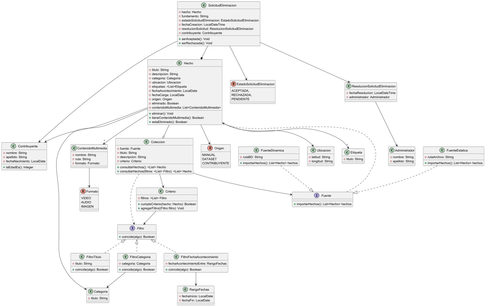

# Entrega 1

## Justificaciones Diagrama de Clases y Diseño Inicial


### Fuentes

Las Fuentes fueron modeladas como una Interface. Esto se debe a que consideramos que su existencia estará reflejada en la capa de services. Por ende, una colección unicamente conoce la interfaz Fuente, que se instanciará en la capa de services de forma que no se rompa la arquitectura. La "comunicacion" entre las dos clases quedará definida por la inyección de dependencias establecida en la clase colección.

La colección conoce que existe una abstracción que le otorga una lista de hechos, pero no conoce el detalle de cómo funciona esta abstracción. Esto genera que la colección tenga bajo acoplamiento a una Fuente.

```java
public class Coleccion {
    private String titulo;
    private String descripcion;
    private Fuente fuente;
    ///...
}
```

### Importar archivos CSV

La imporación de archivos CSV está bajo la responsabilidad de una clase Fuente Estática. Esta se encarga de leer un archivo CSV e instanciar los Hechos del mismo. Esta clase se encuentra en la capa de services.

### Colecciones

En el caso de las `Colecciones`, se las diseñó con sus respectivos atributos identificatorios y sin una lista de Hechos. Las `Colecciones` poseen un `Criterio`, que será quien tendrá la responsabilidad de determinar si un `Hecho` cumple con los requisitos para pertenecer a la `Colección`.

Las `Colecciones`, al ser consultadas, devuelven los `Hechos` que pertenecen a ellas; contemplando que se podrían consultar utilizando filtros. Cada vez que se consultan los hechos de la colección esta le consulta a la fuente y realiza el filtrado correspondiente.

Las `Colecciones` no tienen una `List<Hechos>` ya que en caso de tener una gran cantidad de colecciones, se usaría ineficientemente la memoria por guardar `Hechos` que no están siendo requeridos. Es por esto que la colección únicamente devuelve los hechos que la fuente le otorga.

### Criterios de pertenencia

Los `Criterios` de pertenencia fueron representados como una clase. Para el `Criterio`, se decidió utilizar el **Patrón Strategy**. Cada `Criterio` tiene una lista de `Filtro`, encargados de que para un `Hecho` se cumpla una característica en particular, en esta primera iteración: que el hecho tenga un cierto título, una cierta categoría o que su fecha de acontecimiento esté contenida dentro de un rango.

Cada filtro implementa una interfaz `Filtro`, la cual define un método `coincide`; cada elemento se encarga de definir este método a su conveniencia.

### Filtros vs Criterios

Queda definida una diferencia entre `Filtros` y `Criterios`: un `Filtro` es una interface que determina el método coincide, para que los filtros que la utilicen definan la lógica. Esto permite que en un futuro se agreguen más filtros pero que no se modifique la lógica, dando mayor **extensibilidad**, aplicando el **Principio Open-Close**.
Para los `Filtros` usamos el principio de abierto cerrado, ya que con la interfaz `Filtro` estamos abiertos a la expansion futura de posibles filtros a implementar, pero estamos cerrados a la modificacion del comportamiento de estos filtros

### Contribuyentes y visualizadores

Para la solución implementada, no se modelaron los visualizadores ni los administradores. Se entiende que un visualizador es una persona que ingresa al sistema como ***Guest***. Como no se guarda información del mismo y no tiene ningún tipo de relación con nuestro dominio, no se vio necesario su diagramado.

El visualizador será un usuario más que interactuará con el sistema, pero que esté presente en los casos de uso no significa que sea una clase en el mismo.

Los visualizadores como los contribuyentes podrán subir hechos utilizando la interfaz del sistema pero sin relacionarse con los mismos.

En caso de que un Contribuyente quiera "dejar su firma" (darse a conocer) en un `Hecho`, el mismo tendrá un atributo Contribuyente en el que se guardará quién realizó esa contribución, utilizando al contribuyente como un **Value Object**.

### Administradores

Los Administradores no fueron incluidos en el diagrama como una clase. Esto se debe a que las acciones que realizan: crear colecciones, aceptar o rechazar solicitudes o importar hechos desde un archivo CSV son casos de uso.

Los Administradores podrán cumplir con estas funcionalidades utilizando la interfaz del sistema. Todas estas funcionalidades y responsabilidades fueron delegadas a las clases correspondientes:

### Caso crear colección

La creación de una colección quedó delegada a la instanciación de la misma. Cuando un administrador decida crear una colección podrá completar los datos de la misma y será la capa de controllers quien enviará esta petición a la capa de servicios y esta creará la `Colección` instanciándola en el sistema.

### Aceptar o Rechazar solicitud de eliminación

La `SolicitudEliminación` cuenta con los métodos respectivos para ser aceptada o rechazada. Por lo que al aceptar la misma o rechazarla esta marcará al `Hecho` como eliminado o no.

### Etiquetas

Las etiquetas poseen un atributo de tipo String. Un `Hecho` puede tener muchas etiquetas. Las cuales conserva en una lista.

## Diagrama de Casos de Uso


