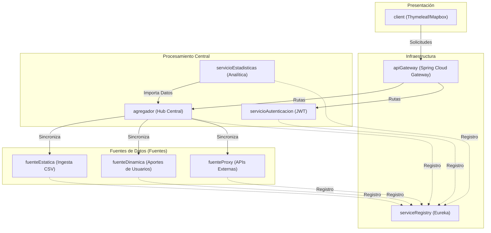
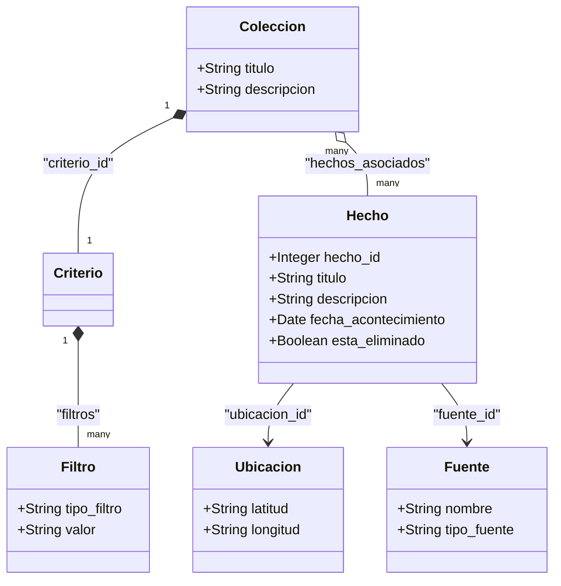

# MetaMapa — Plataforma Colaborativa de Eventos Geolocalizados

[](https://deepwiki.com/BrunoRodriguezzz/tp-dsi)

**MetaMapa** es una plataforma distribuida diseñada para agregar, normalizar y visualizar hechos (eventos) geolocalizados provenientes de diversas fuentes. Permite a los usuarios explorar mapas de eventos, contribuir con nuevos datos y organizar la información en colecciones curadas mediante algoritmos de consenso y criterios de filtrado avanzados.

---

## 🏗️ Arquitectura del Sistema

El sistema utiliza una arquitectura de **microservicios** desacoplados, construida con **Spring Boot 3** y **Spring Cloud**. La comunicación entre servicios se gestiona a través de un API Gateway y un registro de servicios (Eureka).

### Topología de Servicios y Flujo de Datos



---

## 🛠️ Stack Tecnológico

*   **Backend:** Java 17, Spring Boot 3.2.5, Spring Cloud (2023.0.1).
*   **Descubrimiento de Servicios:** Netflix Eureka.
*   **Seguridad:** JWT (JSON Web Tokens) y encriptación BCrypt.
*   **Base de Datos:** MySQL 8 con Hibernate/JPA para persistencia.
*   **Frontend:** Thymeleaf, Mapbox GL JS para visualización geoespacial, Bootstrap 5.
*   **Procesamiento de Datos:** Project Reactor (Programación Reactiva/Flux) y OpenCSV.

---

## 📦 Mapa de Módulos

| Módulo | Puerto | Responsabilidad |
| :--- | :--- | :--- |
| `serviceRegistry` | 8088 | Servidor Eureka para el descubrimiento de servicios. |
| `apiGateway` | 8086 | Punto de entrada único, enrutamiento y validación de JWT. |
| `agregador` | 8082 | Hub central de hechos normalizados y gestión de colecciones. |
| `fuenteDinamica` | 8081 | Gestión del ciclo de vida de eventos reportados por la comunidad. |
| `fuenteEstatica` | 8084 | Procesamiento y servicio de datos desde archivos CSV. |
| `fuenteProxy` | 8083 | Sincronización con instancias externas de MetaMapa y APIs de terceros. |
| `servicioAutenticacion`| 8087 | Gestión de usuarios, roles y emisión de tokens de seguridad. |
| `servicioEstadisticas` | 8085 | Motor de analítica multidimensional y reportes. |
| `domain` | N/A | Librería compartida de entidades JPA y lógica de negocio. |
| `client` | Var | Aplicación web para el usuario final. |

---

## 🧩 Modelo de Dominio

El núcleo del sistema es la entidad **Hecho**, la cual se enriquece con datos de ubicación y categorías normalizadas.



---

## 🚀 Procesos Clave

### 1. Pipeline de Ingesta Reactiva
El `Agregador` utiliza un flujo no bloqueante para procesar registros de forma eficiente:
1. **Normalización:** Resolución de sinónimos de categorías y estandarización de formatos.
2. **Enriquecimiento:** Validación de límites administrativos y metadatos geográficos.
3. **Persistencia en Lote:** Optimización de I/O mediante guardado por bloques.

### 2. Sistema de Consenso
Para garantizar la veracidad de los datos, se aplican estrategias de validación entre fuentes:
*   **Consenso Absoluto:** El hecho debe figurar en todas las fuentes disponibles.
*   **Mayoría Simple:** Presente en más del 50% de las fuentes.
*   **Múltiples Menciones:** Reportado por al menos dos fuentes con atributos idénticos.

### 3. Moderación y Seguridad
*   **Solicitudes de Eliminación:** Requieren fundamentación mínima y pasan por un filtro de spam (TF-IDF).
*   **Seguridad:** Autenticación centralizada vía JWT con validación en el Gateway para proteger los microservicios internos.

---

## ⚙️ Configuración y Ejecución

### Requisitos Previos
*   Java 17+.
*   Maven 3.8+.
*   MySQL 8.0.
*   Token de Mapbox (configurar en el cliente).

### Compilación General
Desde la raíz del proyecto:
```bash
mvn clean install -DskipTests
```

### Ejecución (Orden Recomendado)
1. `serviceRegistry` (Puerto 8088)
2. `servicioAutenticacion` (Puerto 8087)
3. `apiGateway` (Puerto 8086)
4. Otros microservicios (`agregador`, fuentes, `servicioEstadisticas`).

---

## 🧪 Estrategia de Testing

El proyecto cuenta con una suite de pruebas integral:
*   **Unitarias:** Validación de algoritmos de consenso y lógica de comparación de hechos.
*   **Integración:** Pruebas de pipelines reactivos (`StepVerifier`) y comunicación entre microservicios.
*   **Seed Data:** Sistema de carga automática de datasets históricos para facilitar el desarrollo.

---
*Este proyecto fue desarrollado como parte de la cátedra de Diseño de Sistemas de Información (DSI).*
